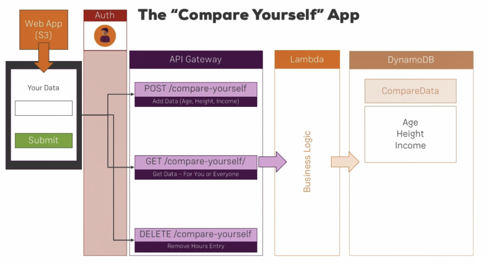

## About The Project

### The "Compare Yourself" App

This will be a single-page web app that allows the user to enter data and compare himself/herself like height or age by calling API gateway endpoints. These endpoints are POST, GET, and DELETE.

These endpoints will be auth protected, so only registered users are able to store, get and delete data.

This app will be implemented Lambda functionality and the data will be stored in the DynamoDB database.

