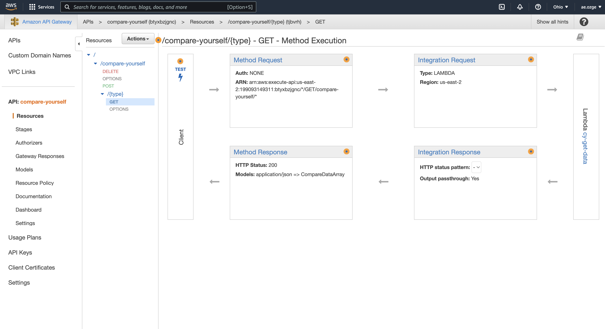

## API Gateway 

- Creating Rest APIs with ease.
- We can create endpoints which are combinations of resources, paths and HTTP methods so that you get URLs to which you can send 
requests and trigger some action that directly accesses some AWS services like Lambda that runs code on demand.

### Creating a New API

AWS console => API Gateway => Create API => REST API => New API and write an api name

### Creating a Resource(URL Path)

In Resources Actions => Create Resource => write a name which will be the path for the URL.

### Creating a HTTP Method

In Resources Actions => Create Method => can select POST/GET/DELETE => Integration Type : Lambda (for this project), select Lambda Function => Deploy API once getting completed Method Execution.

