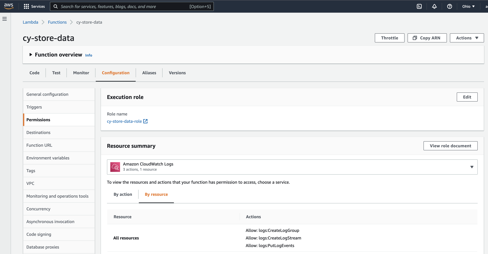

## What is DynamoDB?

DynamoDB is a fully managed noSQL database provided by AWS. There are no relations in the database.

The data format for this is key-value pairs, without a schema.

## Creating a table

AWS console => DynamoDB => Create table: table name and partition key

In DynamoDB table, we are always required to provide a partition key on each item, which has to be unique.

## Accessing DynamoDB from Lambda

### Setting Policies and Roles

First need to set up roles and policies to have fully access the DynamoDB.

AWS console => IAM (Identity and Access Management) => Policies and Roles

Created policies for each roles and the roles created for the each methods. These are POST, GET and DELETE.

#### Policies

#### Roles

### Setting up Lambda Function

For this project, there are 3 functions :

cy-delete-data	
cy-store-data	
cy-get-data

In Lambda => Functions => cy-store-data => Configuration => add role name for this function

Accessing DynamoDB from Lambda

#### Passed data from API Gateway to lambda and create a new entry into DB with testing it on Web

Using POST method, added a new data ({age: 30, height: 180, income: 3300}) to the db. 

With GET method, we see all the entries in the DB.

